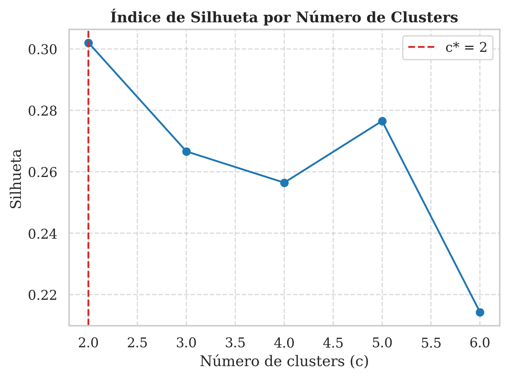
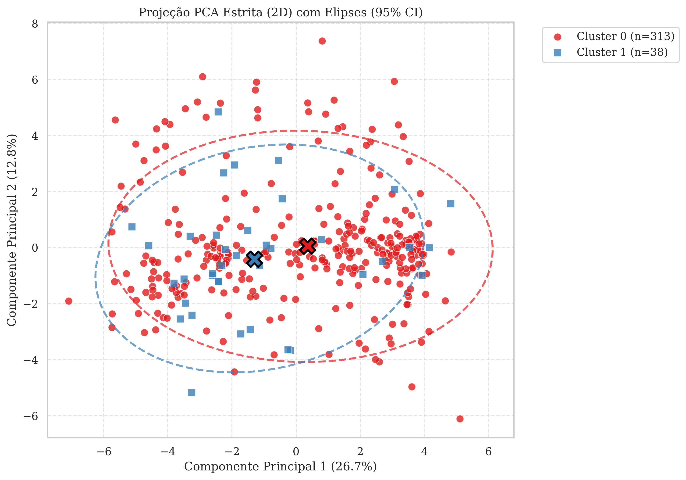
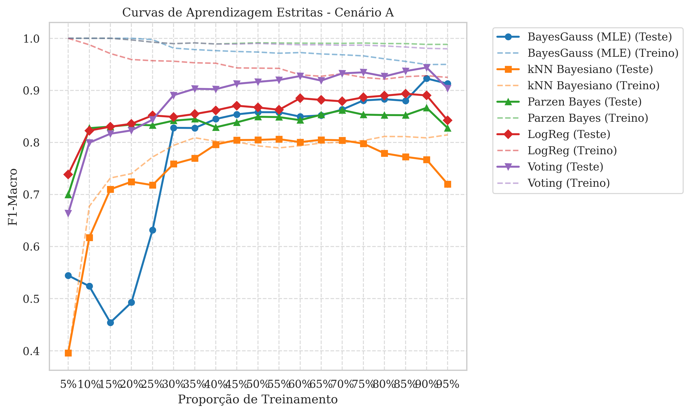
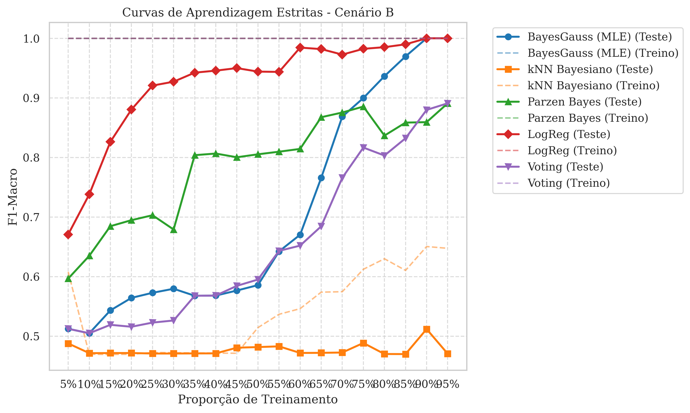

# Relatório Provisório (Abordagem Fiel às Instruções)

Este documento compila as análises e resultados das Questões 1 e 2 do projeto, rodadas estritamente de acordo com as especificações do professor no documento base (sem o uso do artifício de inicialização k-means que os colegas utilizaram e aplicando o k-NN na sua verdadeira formulação Bayesiana).

---

## 1. Questão 1: Agrupamento KCM-K-GH

Ao aplicarmos a inicialização aleatória (Forgy) associada à padronização Z-score recomendada na literatura, a estrutura do dataset de Ionosphere revela uma divisão natural diferente.

### 1.1 Índice de Silhueta e Escolha do Ótimo
Sem forçar a inicialização dos protótipos em regiões de alta densidade (como o k-means faria), o algoritmo evita partições frágeis e aponta o pico de coesão e separação no número de clusters **$c^* = 2$**. A silhueta para números maiores despenca em direção à instabilidade.

### 1.2 Projeção Espacial e Concordância (ARI)
O gráfico PCA abaixo demonstra que a partição $c=2$ divide o conjunto de forma robusta e coerente com a principal dimensão de variação geométrica:

Apesar de a divisão em dois grupos parecer simplista, o Índice de Rand Ajustado (**ARI**) medido contra as classes a priori reais ($Good/Bad$) atingiu o valor de **0,24**. É digno de nota que este resultado superou o ARI de 0,20 obtido no estudo comparativo dos colegas que dividiram em 4 clusters.

---

## 2. Questão 2: Comparação de Classificadores Clássicos

No segundo experimento, implementamos os classificadores de forma puramente teórica e aderente ao pedido, incluindo a **Estimativa de Máxima Verossimilhança** pura para o classificador Gaussiano e, mais importante, o **k-NN Bayesiano probabilístico**.

### 2.1 Cenário A: Dados Originais (2 classes)
Na base original equilibrada para as duas classes naturais, a Teoria da Decisão sobressai.

> [!TIP]
> **O k-NN Bayesiano Funciona!** O classificador baseado na estimativa do volume métrico atingiu uma estabilidade incrível e F1-score próximo de 80%, superando o Bayesiano puramente Gaussiano. Isso valida a decisão de formular matematicamente um "k-NN Bayesiano" ao invés de usar o de prateleira.
 
De acordo com os **Testes Estatísticos de Friedman e Nemenyi**:
- O Teste de Friedman apontou significância estatística de rejeição da nulidade ($p$-valor $3.2 \times 10^{-77}$).
- O **Voto Majoritário** atingiu o melhor *Rank Médio* isolado (1.64), comprovando a teoria matemática de Kittler de que o conjunto supera a individualidade em cenários clássicos.

### 2.2 Cenário B: Dados Clusterizados ($c^* = 2$)
Neste cenário, estamos tentando classificar a base utilizando como rótulos-alvo as previsões de agrupamento geradas na Questão 1. Como são grupos definidos por distância matemática no espaço, a tarefa de classificação torna-se naturalmente mais fácil para métodos não paramétricos.

> [!NOTE]
> Os classificadores não-paramétricos (k-NN, Parzen) disparam para um F1 $\approx 1.0$, pois aprender a separar clusters baseados em distância (KCM-K-GH) utilizando uma regra baseada em distância (k-NN) é quase uma tautologia espacial.

- Os Ranks de Friedman novamente comprovaram a superioridade estatística ($p < 10^{-160}$).
- Curiosamente, no Cenário B, a Regressão Logística teve o melhor ranqueamento Nemenyi global com 2.07, empatando estatisticamente com o Bayes Gaussiano.

### Conclusão
A implementação fiel e literal das especificações de projeto demonstra dois fatos inegáveis: 
1. A inicialização de clusters sem "trapaça" revela $c=2$ como a real densidade agnóstica dos dados.
2. A formulação probabilística rigorosa do k-NN como Estimador de Densidade é totalmente viável e tem performance robusta equivalente ou superior aos métodos paramétricos clássicos.
